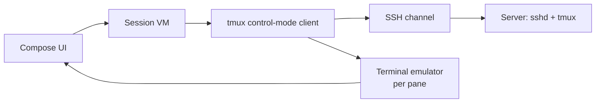
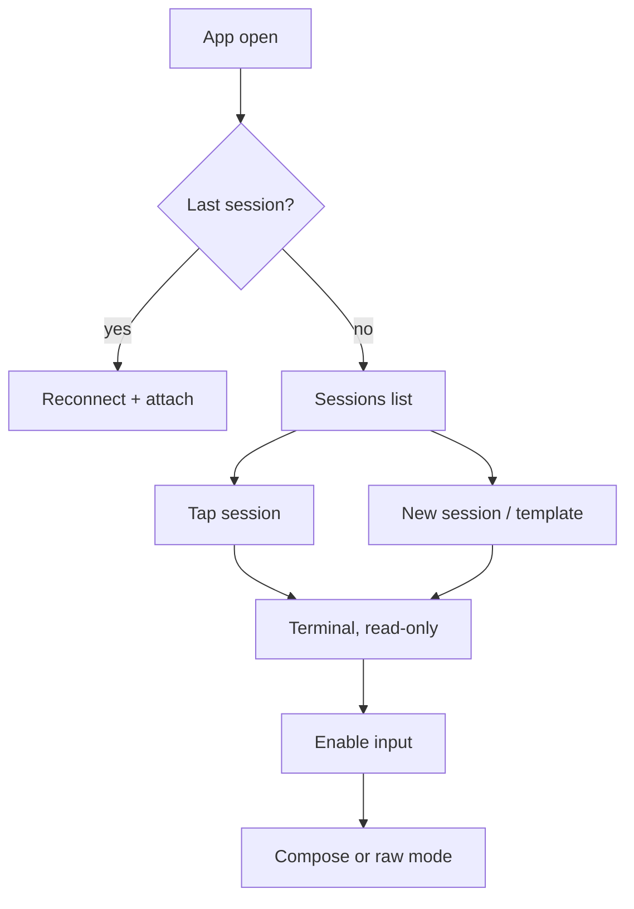

# tmux Mobile Client — Product Spec

Sep 22, 2026 · @Someone

## Vision and principles

A native Android tmux client for the Play Store: SSH in, land directly on your tmux sessions, work with the phone's own keyboard. AI-agent supervision is an optional, opt-in layer.

**Target users**

- Sysadmins and homelab users managing long-running jobs over SSH.
- Developers who keep work alive in tmux on remote machines.
- AI-agent users running Claude Code, Codex, Gemini CLI, Aider, OpenCode or Hermes-style TUIs (Pro).

**Principles**

1. **Cockpit, not workstation.** The phone is for watching, deciding and short instructions, not writing code.
2. **Sessions first.** Connecting lands on the session list, never a bare shell prompt.
3. **System keyboard only.** No custom on-screen keyboard; Gboard, SwiftKey, voice dictation and autocorrect work fully.
4. **Zero server install for the core.** Only `tmux` and `sshd` are required.
5. **Agents optional and vendor-neutral.** Off by default; no dependency on any AI vendor.
6. **Safe by default.** Attach read-only; typing is an explicit action.

## Architecture

The app talks to tmux through **control mode** (`tmux -CC`) over one SSH channel, so sessions, windows and panes are structured data rather than scraped screen text.

| Layer | Choice | Notes |
| --- | --- | --- |
| Language / UI | Kotlin, Jetpack Compose | Min SDK 26 (Android 8) |
| SSH | sshj or mwiede/jsch | Ed25519/RSA keys, agent forwarding off by default |
| Terminal rendering | Termux `terminal-emulator` + `terminal-view` | Verify license before shipping |
| tmux protocol | Control mode parser (`%output`, `%window-add`, `%session-changed`, `%exit`) | Needs tmux 2.x+; target 3.x |
| Storage | Room (hosts, macros), Android Keystore (keys, secrets) | No cloud sync in MVP |
| Background | Foreground service while attached | Keeps the connection alive when the app is backgrounded |



Each pane's `%output` stream feeds its own terminal emulator instance; input goes back as `send-keys` commands on the same channel.

## Core features (free, MVP)

Everything here works with only `sshd` and `tmux` on the server.

| Feature | Behavior | Server command |
| --- | --- | --- |
| Host manager | Save hosts, users, ports, keys; generate Ed25519 keys in-app | — |
| Session list | Shown immediately after connect | `list-sessions -F '#{session_name}\|#{session_windows}\|#{session_attached}\|#{session_activity}'` |
| Process labels | Show what runs in each session (claude, hermes, vim, htop) | `list-panes -a -F '#{session_name}\|#{pane_current_command}'` |
| Attach | Tap a session to attach in control mode | `tmux -CC attach -t <name>` |
| Window/pane switcher | Tabs for windows, visual pane map, swipe between | Control-mode events |
| New session | Name + start directory + optional start command | `new-session -A -d -s <name> -c <dir> '<cmd>'` |
| Templates | Saved presets, e.g. repo dir + launch command | Same as above |
| Macros | Saved commands/prompts per host or session | `send-keys -l` |
| Scrollback | Load on demand, searchable | `capture-pane -p -S -<n>` |
| Auto-reconnect | Resume last session after network change or app restart | Re-attach |
| Read-only attach | Default; tap to enable input | Client-side gate |
| Multi-server | Several hosts, one combined session list | Parallel connections |
| Themes | Light/dark + popular terminal palettes | — |

## Input model

All typing goes through the phone's own keyboard. The app never ships an on-screen keyboard.

**Compose mode (default)**

- A standard Compose `TextField` pinned above the IME, with normal input type, so swipe, autocorrect, voice dictation and language switching work.
- Multi-line input; Send button or Enter-to-send (setting).
- On send: `send-keys -t <pane> -l "<text>"` then `send-keys -t <pane> Enter`. The `-l` flag stops tmux from interpreting words like `Enter` or `C-c`.
- History of sent lines per session, recalled with Up swipe.

**Raw mode (toggle)**

- A custom `InputConnection` forwards each keystroke immediately, for vim, less, htop and TUI menus.

**Special keys without an on-screen keyboard**

| Key | Method |
| --- | --- |
| Ctrl+C, Ctrl+D, Ctrl+Z | Tokens in the compose field (`^c`, `^d`, `^z`) parsed before send |
| Esc | Long-press on terminal, or `:esc` token |
| Arrows | Swipe on terminal (hold and drag repeats) |
| Up/Down | Volume keys (setting) |
| Tab | `:tab` token or two-finger tap |
| All keys | Hardware/Bluetooth keyboard through `onKeyEvent` |

An optional one-row key strip (Ctrl, Esc, Tab, arrows) above the IME is off by default.

## Screens and flows

Five screens cover the MVP; the session list is the home screen.

| Screen | Contents |
| --- | --- |
| Hosts | Saved servers, connection status, add/edit, key management |
| Sessions (home) | All sessions across connected hosts: name, process label, windows, last activity, attached flag |
| Terminal | Pane view, window tabs, pane map, compose bar, read-only/input toggle |
| Macros & templates | Saved commands and session presets, per host |
| Settings | Themes, gestures, volume keys, Enter behavior, security |



Back from Terminal detaches the client view only; the tmux session keeps running.

## Agent layer (optional, Pro)

A separate server companion, installed only by users who want it, reports agent state to the app. Without it, no agent UI appears.

**Companion daemon (`muxd`, working name)**

- Single static binary (Go or Rust), runs as a user service.
- Listens on a Unix socket; the app reaches it through the existing SSH connection (`direct-streamlocal`), so no open ports.
- Push for when the app is closed: ntfy (self-hostable) or FCM through a relay the user opts into.

**Vendor-neutral event protocol (JSON lines)**

```json
{"v":1,"session":"api","pane":"%3","agent":"claude-code","state":"needs_approval","title":"Edit src/auth.ts","detail":"...","id":"evt_123","ts":1790000000}
```

| State | Meaning |
| --- | --- |
| `working` | Agent is running |
| `needs_approval` | Waiting on a permission decision |
| `needs_input` | Waiting for a prompt or answer |
| `done` | Task finished |
| `error` | Agent failed or crashed |

**Adapters**

| Agent | Source |
| --- | --- |
| Claude Code | Hooks: `Notification`, `Stop`, `PreToolUse` call `muxd emit` |
| Codex, Gemini CLI, OpenCode, Aider | Their hook/notify config where available |
| Any TUI (e.g. Hermes) | Generic: `muxd emit` from scripts, or idle/pattern detection on pane output |

**Pro features built on it**

- State badges on the session list.
- Approvals inbox with Approve/Deny from notifications; the app answers by `send-keys` to the right pane.
- Diff viewer (`git diff` rendered) before approving edits.
- "While you were away" summary of new scrollback, using the user's own API key or a local model.
- Multi-server agent dashboard.

## Security, privacy and Play Store

No user data leaves the device except over the user's own SSH connections.

- Private keys and API keys stored in Android Keystore; never exported, never synced.
- Biometric app lock (optional) and biometric confirmation before enabling input (optional).
- Host key verification with a clear warning on changed fingerprints.
- No telemetry by default; crash reporting opt-in only.
- Play Data Safety form: no data collected or shared (core); summaries send pane text only to the provider the user configures.
- Privacy policy page required before listing.
- Foreground service type `connectedDevice` or `dataSync` must be declared and justified for Android 14+.

**Licensing to verify before shipping**

- Termux `terminal-emulator` / `terminal-view` license terms.
- SSH library license (sshj: Apache 2.0).
- Any code taken from MuxPod or other open-source clients.

## Monetization and roadmap

Free core builds the user base; Pro (subscription or one-time unlock) covers the agent layer.

| Phase | Scope | Exit criteria |
| --- | --- | --- |
| 0 — Spike | SSH + control-mode parser + one pane rendered | Attach to a live Claude Code session from the phone |
| 1 — Core MVP | Hosts, session list, attach, compose/raw input, gestures, auto-reconnect | Daily use replaces Attach for you |
| 2 — Play Store beta | Themes, macros, templates, read-only default, privacy policy, Data Safety | Closed testing track with 20+ testers |
| 3 — Agent layer | `muxd`, protocol v1, Claude Code adapter, state badges, approvals inbox | Approve a Claude Code edit from a notification |
| 4 — Pro expansion | Diff viewer, summaries, more adapters, multi-server dashboard | Paid tier live |

## Open questions

- [ ] App name and package id (check Play Store for conflicts with "Attach").
- [ ] Pro pricing: subscription vs one-time unlock.
- [ ] Companion language: Go or Rust.
- [ ] Push path: ntfy only, or also an FCM relay you host.
- [ ] Minimum tmux version to support (control mode quirks before 3.x).
- [ ] iOS later, or Android only (Kotlin Multiplatform vs native).
