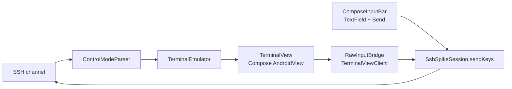

# Phase 1, sub-project 1 — real terminal rendering + input (design)

**Date:** 2026-09-23
**Status:** approved for planning
**Parent doc:** `docs/reference/product-spec.md` (full 5-phase product spec)
**Builds on:** `docs/specs/2026-09-23-phase0-spike-design.md` (Phase 0 spike, complete)

## Purpose

Phase 0 proved the protocol layer works: control-mode parsing, SSH plumbing,
bidirectional round-trip to a real tmux session, verified on a real phone.
Phase 1 in the product spec's roadmap ("Core MVP") bundles several
independent subsystems — terminal rendering, host/session management, and
auto-reconnect among them — so it's being built as separate sub-projects
rather than one spec. This is the first: replace Phase 0's raw-text dump with
real terminal rendering and real input, still against the one hardcoded test
session Phase 0 used. Host management, multi-session navigation, and
auto-reconnect are later sub-projects.

**Exit criterion:** attach to a real Claude Code tmux session from the phone
and confirm (a) output renders properly — colors, cursor, formatting, not raw
escape codes — (b) you can drive it via compose-mode text, and (c) you can
navigate a raw-mode TUI (`vim` or `htop`) using Esc and arrow gestures. This
raises the bar past Phase 0's synthetic single-string test.

## Explicit non-goals for this sub-project

- No host manager, no session list, no multi-host/multi-session UI — still
  the one hardcoded SSH target and tmux session from Phase 0.
- No multi-pane support. One `TerminalEmulator` instance for the one pane;
  the `Map<paneId, TerminalEmulator>` this implies for window/pane switching
  is deferred to that sub-project, not built speculatively now.
- No volume-key Up/Down binding, no two-finger-tap Tab. Esc (long-press) and
  arrows (swipe) are in scope; the rest of the special-key table is not.
- No auto-reconnect (still Phase 0's behavior: error shown, app relaunch
  required — confirmed working as designed during Phase 0's phone
  verification).
- No custom on-screen keyboard or key-strip UI. Per the product spec's
  Principle #3 and reinforced directly by the operator during this design:
  the system keyboard (Gboard/SwiftKey/voice dictation) stays the only input
  surface. Esc/arrows are terminal-view gestures, not keyboard UI; the
  spec's optional Ctrl/Esc/Tab/arrows key strip stays off by default if it's
  ever built.

## Licensing note (carried over, not resolved here)

Termux's `terminal-emulator`/`terminal-view` licensing is ambiguous: the
inherited Jackpal Terminal Emulator for Android base is Apache 2.0, but
Termux's own additions are GPLv3, and even Termux's maintainers haven't
given a clean answer on where the line falls for these specific modules
([termux-app#4257](https://github.com/termux/termux-app/issues/4257), open
and unanswered as of this writing). Decision: use it now for development:
standard, battle-tested choice, and the risk is fully deferred since Phase 1
isn't a Play Store submission (that's Phase 2's exit criterion). Must be
resolved definitively — separate legal review if needed — before Phase 2.

## Architecture

Extends Phase 0's `SshSpikeSession` + `ControlModeParser` (both keep working
unchanged) with a rendering and input layer:

- `PaneOutput.text` (already octal-decoded by `ControlModeParser`, Phase 0)
  feeds `TerminalEmulator.append` instead of a `String` accumulator.
- `TerminalView` (Termux) renders the emulator's screen buffer; wrapped via
  Compose's `AndroidView`.
- Raw mode: `TerminalView` ships its own `TerminalViewClient` interface for
  key/gesture callbacks — this *is* the spec's "custom `InputConnection`
  forwards each keystroke immediately" mechanism, already built into the
  library. `RawInputBridge` implements this interface and translates key
  events plus two gestures (long-press → Esc byte, swipe → `send-keys
  Up/Down/Left/Right`) into calls on `SshSpikeSession`.
- Compose mode: `ComposeInputBar`, a Compose `TextField` + Send button.
  On send: `send-keys -t <pane> -l "<text>"` then `send-keys -t <pane>
  Enter`.
- A mode toggle (raw/compose — design approach A, chosen over a
  always-raw-with-overlay alternative for matching the spec's own mental
  model and keeping one input state instead of two UI surfaces) switches
  which surface is focused/active.
- `SshSpikeSession` gains a general `sendKeys(paneId, keys: String, literal:
  Boolean)` method, replacing Phase 0's one fixed test-string call.

## Data flow

**Output:** SSH channel → `ControlModeParser.parseLine` → `PaneOutput.text`
→ `TerminalEmulator.append` → `TerminalView` renders.

**Input:** system keyboard → (raw mode: `TerminalView`'s own key handling
via `RawInputBridge`, or compose mode: `ComposeInputBar`) →
`SshSpikeSession.sendKeys` → SSH channel → tmux `send-keys`.

## Error handling

Unchanged from Phase 0: connection errors rendered visibly in the UI, no
auto-reconnect, no new error-handling surface — this sub-project doesn't
touch connection lifecycle.

## Testing

- Gesture/key → tmux-key-name translation (e.g., swipe-down → `"Down"`) is
  pure logic — unit-testable, TDD, matching Phase 0's
  `ControlModeParserTest` style.
- `TerminalEmulator`/`TerminalView` wiring is integration-level, not
  meaningfully unit-testable — verified against the exit criterion on a
  real phone, same as Phase 0.

## Known implementation risk

Termux's `terminal-emulator`/`terminal-view` isn't a normal Maven Central
artifact — typically pulled via JitPack against the termux-app repo, or
vendored as source. The exact dependency wiring is an implementation-time
question for whoever builds this (verify from primary sources, same
discipline as Phase 0), not resolved in this design.
