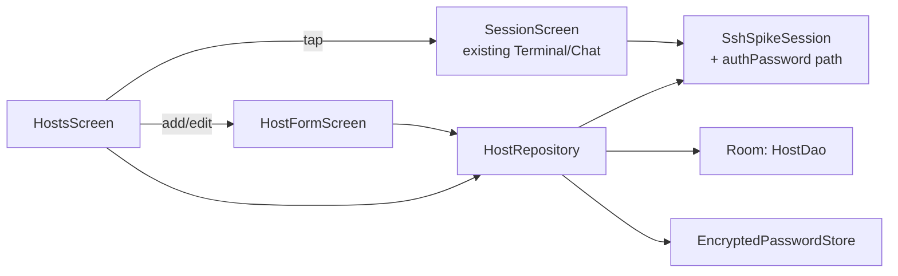

# Host manager (design)

**Date:** 2026-09-24
**Status:** approved for planning
**Parent doc:** `docs/reference/product-spec.md` (full product spec — this sub-project
corrects that doc's key-only auth assumption; see "Deviation from the product spec" below)
**Builds on:** `docs/specs/2026-09-23-phase1-terminal-rendering-design.md` (Phase 1
sub-project 1, complete) — the Terminal/Chat screen this sub-project connects to already
exists and is unchanged in shape, only in how it gets its connection info.

## Purpose

Everything built so far (Phase 0, Chat view, real terminal rendering) runs against one
hardcoded host, port, username and SSH key baked into `MainActivity.kt`'s constants.
There is no way for an actual user to point the app at their own server. This
sub-project replaces those constants with a real first screen: add a server by
hostname/IP, username and password; see saved servers in a list; tap one to open the
existing Terminal/Chat screen against it.

**Exit criterion:** on a real phone, with no hardcoded constants left in the connection
path, add a new host by IP + username + password, see it in the host list, tap it, and
land on the existing Terminal screen actually connected to that host. Edit and delete a
saved host. Reconnecting to a host whose server host key has changed since it was first
added shows a clear warning instead of silently connecting.

## Deviation from the product spec

`docs/reference/product-spec.md`'s Host manager row says "Save hosts, users, ports,
keys; generate Ed25519 keys in-app" — key-based auth only. The operator corrected this
directly during this sub-project's brainstorming: **real customers authenticate with a
username and password, not SSH keys.** This design builds password auth as the host
manager's only user-facing auth method. `SshSpikeSession`'s existing key-based
`authPublickey` path is kept as-is, not replaced — Hermes's own device-testing setup
authenticates to the dev VPS with a bundled test key, and breaking that isn't in scope
here. The host manager UI simply never exposes key entry; `SshSpikeSession` grows a
password path alongside the existing key path.

## Explicit non-goals for this sub-project

- No in-app SSH keygen or key import UI (superseded by the deviation above — may return
  later for users who explicitly want key auth, not scoped now).
- No session list (`list-sessions`, process labels, new-session flow) — that's the next
  sub-project, building on top of the host manager. Tapping a host in this sub-project
  goes straight to the existing single-session Terminal/Chat screen, still targeting one
  hardcoded tmux session name, exactly as it does today.
- No multi-server "combined session list" — out of scope until session list exists.
- No macros, templates, or themes.

## Architecture

- **Data model (Room):** a `Host` entity — `id: Long, name: String, hostname: String,
  port: Int, username: String, hostKeyFingerprint: String?`. `hostKeyFingerprint` starts
  null and is filled in on first successful connect (trust-on-first-use, see Security).
- **Password storage:** never in the Room row. Stored via
  `EncryptedSharedPreferences` (Jetpack Security, backed by Android Keystore), keyed by
  host id, in a separate preferences file from anything else the app stores.
- **`SshSpikeSession`** gains a second constructor path / parameter for password auth
  (`authPassword(username, password)` via sshj) alongside its existing
  `authPublickey(username, key)` path — see Deviation above. Host-key verification
  changes from the current `PromiscuousVerifier()` (accepts any key — this was already
  flagged as tech debt in the code) to a verifier that checks the host's stored
  fingerprint, described in Security.
- **Navigation:** `MainActivity` becomes a two-destination nav host (`navigation-compose`,
  not yet a dependency — standard AndroidX artifact) instead of a single Composable:
  `HostsScreen` (start destination) and the existing session screen, now taking a `Host`
  argument instead of reading `HOST`/`PORT`/`USERNAME` constants directly.

## Data flow

**Add a host:** `HostFormScreen` → `HostRepository.save(host, password)` → Room insert
(host row, no password) + `EncryptedPasswordStore.put(hostId, password)`.

**Connect:** `HostsScreen` tap → load `Host` + password from repository →
`SshSpikeSession(context, host.hostname, host.port, host.username, password)` →
`authPassword` → on first connect, capture and store the server's host key fingerprint
on the `Host` row; on later connects, compare against it.

**Edit/delete:** standard Room update/delete on the host row; delete also removes the
stored password.

## Security

- **Password at rest:** `EncryptedSharedPreferences` only — never written to Room, never
  logged (the existing `Log.i`/`Log.e` calls elsewhere in the codebase must not be
  extended to cover connection setup with password values in scope).
- **Host key verification (trust-on-first-use):** replaces `PromiscuousVerifier()`.
  First connect to a host: accept whatever key the server presents, store its
  fingerprint on the `Host` row, proceed. Every later connect: compare the presented
  key's fingerprint against the stored one. Match → proceed silently. Mismatch → block
  the connection and show an explicit warning (do not auto-connect past it) — this is
  the same threat model as SSH's `known_hosts`, scoped down to per-host state in Room
  instead of a shared file.
- Transport itself (TLS/SSH encryption) is unchanged — this only changes what gets
  verified and how credentials are stored, not the wire protocol.

## Screens

| Screen | Contents |
| --- | --- |
| Hosts (new start destination) | List of saved hosts (name, hostname, username); tap to connect; add button; edit/delete per row |
| Add/Edit Host | Name, hostname, port (default 22), username, password fields; Save |
| Host-key mismatch warning | Shown in place of connecting, when a stored fingerprint doesn't match; explicit "this could mean the server changed or something is intercepting your connection" language, no silent bypass |

The existing Terminal/Chat screen (Phase 1 sub-project 1's work) is unchanged in
content; it now receives a `Host` instead of reading global constants.

## Error handling

- Wrong password / auth failure: surfaced inline on the Hosts screen (e.g., a failed
  connect attempt shows an error, doesn't crash, doesn't silently retry).
- Unreachable host / connection refused / timeout: same pattern, distinct message from
  auth failure so the user knows which end to check.
- Host-key mismatch: see Security above — a distinct blocking screen, not a toast.

## Testing

- `HostRepository`/`HostDao` logic (CRUD, especially delete-cascades-password) is
  unit-testable against an in-memory Room database, matching this project's existing
  JUnit style (`ControlModeParserTest`, `HermesChatAdapterRowTest`, etc.).
- Host-key fingerprint comparison logic (pure string/byte comparison) is unit-testable.
- `EncryptedSharedPreferences` round-trip and the actual screens are integration-level —
  verified on a real device against the exit criterion, same discipline as prior
  sub-projects.

## Known implementation risk

`navigation-compose`'s exact API surface for a two-destination graph with an argument
(`Host`) needs verifying against whatever version the Compose BOM in this project pulls
in — not resolved in this design, an implementation-time question like Phase 1 sub-project
1's Termux dependency was.
